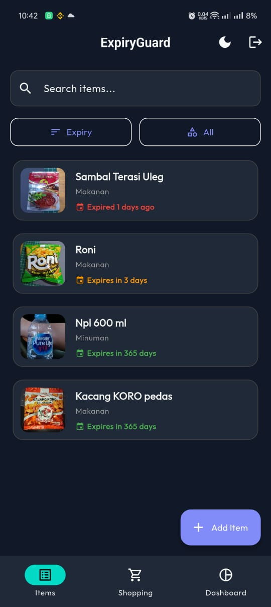
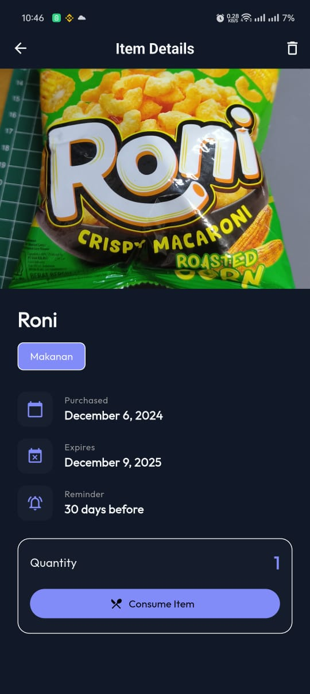

# ExpiryGuard 🍎📅

> **Stop wasting food. Start tracking smart.**

ExpiryGuard is an intelligent inventory management application built with **Flutter**, designed to help households track grocery expiration dates, reduce food waste, and automate shopping lists.


[](TECHNICAL_REPORT.md)
[](build/app/outputs/flutter-apk/app-release.apk)

---

## ✨ Key Features

- **📸 Smart Entry**: Add items quickly using **Barcode Scanning** (OpenFoodFacts) or **OCR Receipt Scanning** (Google ML Kit).
- **🔔 Intelligent Reminders**: Get notified automatically *before* your food expires.
- **📊 Dashboard Analytics**: Visual breakdown of your inventory—see what's Safe, Warning, or Expired at a glance.
- **🔄 Auto-Restock**: When you consume the last item, ExpiryGuard automatically asks to add it to your "Out Of Stock" shopping list.
- **📂 Local-First Media**: Item images are stored securely on your device, saving data and ensuring privacy.
- **🌓 Dark Mode**: Fully supported beautiful UI in both light and dark themes.

## 📱 Screenshots

| Home Dashboard | Item Details | Scan & OCR |
|:---:|:---:|:---:|
|  |  |  |


## 🛠️ Tech Stack

- **Frontend**: Flutter (Dart)
- **State Management**: Riverpod
- **Backend**: Firebase Firestore & Authentication
- **Machine Learning**: Google ML Kit (Text Recognition)
- **Storage**: Local Device Storage (`path_provider`)

## 🚀 Getting Started

### Prerequisites
- Flutter SDK (3.0+)
- Firebase Project configured (providing `google-services.json`)

### Installation

1. **Clone the repository**
   ```bash
   git clone https://github.com/KuroBapak/Final-Projects.git
   cd expiryguard
   ```

2. **Install Dependencies**
   ```bash
   flutter pub get
   ```

3. **Firebase Setup**
   - Place your `google-services.json` in `android/app/`.
   - Place your `GoogleService-Info.plist` in `ios/Runner/`.

4. **Run the App**
   ```bash
   flutter run
   ```

## 🏗️ Project Structure

The project follows a scalable, feature-first architecture:

```
lib/
├── core/            # Global constants, themes, utilities
├── features/        # Feature-based modules
│   ├── auth/        # Login & Registration
│   ├── dashboard/   # Analytics Charts
│   ├── items/       # Core Inventory Logic (Home, Add, Details)
│   └── shopping_list/
├── models/          # Data Models (ItemModel, ShoppingListModel)
└── services/        # Service Layer (Firestore, Barcode, OCR, Storage)
```

## 🤝 Contributing

Contributions are welcome! Please run `flutter analyze` before submitting a PR.

## 📄 License

This project is licensed under the [MIT License](LICENSE).
