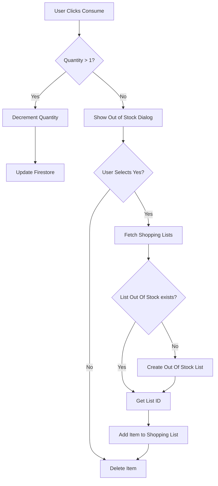

# ExpiryGuard: Comprehensive Technical Report

## 1. Executive Summary
**ExpiryGuard** is a Flutter-based mobile application designed to reduce food waste and streamline inventory management. It leverages local device capabilities (Camera/OCR, Storage) and a cloud backend (Firebase) to track item expiration dates, send timely reminders, and automate shopping list creation when stock runs low.

---

## 2. Application Entry Point (`main.dart`)
The application execution begins here. This is the bootstrap phase.

### A. Initialization
Before the UI renders, we perform critical setup:
1.  **Flutter Binding**: `WidgetsFlutterBinding.ensureInitialized()` ensures the engine is ready.
2.  **Firebase**: `Firebase.initializeApp()` connects the app to the backend.
3.  **Dependency Injection**: The app is wrapped in `ProviderScope` (Riverpod) to enable state management.

```dart
// lib/main.dart
void main() async {
  WidgetsFlutterBinding.ensureInitialized();
  await Firebase.initializeApp(...);
  runApp(const ProviderScope(child: MyApp()));
}
```

### B. Root Widget & Routing (`MyApp`)
`MyApp` is the root widget responsible for routing based on authentication state.
- **Logic**: It watches `authStateProvider`.
    - If `user != null` -> **`HomeScreen`**
    - If `user == null` -> **`LoginScreen`**

```dart
// lib/main.dart
home: authState.when(
  data: (user) => user != null ? const HomeScreen() : const LoginScreen(),
  loading: () => const Scaffold(body: Center(child: CircularProgressIndicator())),
  // ...
),
```

---

## 3. Global Services & Authentication

### A. Authentication (`AuthService`)
**Service**: `AuthService` (`firebase_auth`)
**Logic**: Exposes a stream of user changes.

```dart
// lib/services/auth_service.dart
class AuthService {
  final FirebaseAuth _auth;
  AuthService(this._auth);

  // Used by UI to determine redirection
  Stream<User?> get authStateChanges => _auth.authStateChanges();
}
```

### B. Database (`FirestoreService`)
**Service**: `FirestoreService` (`cloud_firestore`)
**Logic**: Data is siloed per user (`users/{uid}/items`). All writes are performed here.
**Offline**: We rely on the SDK's offline persistence queue. We do NOT await network confirmation for UI blocking, ensuring a smooth experience even with flaky internet.

---

## 4. Feature Implementation & Logic Flows

### A. Expiration Logic (Home Screen)
**File**: `lib/features/items/home_screen.dart`
**Goal**: Display items with a color-coded status (Safe/Warning/Expired).
**Logic**: Standardize dates to **midnight** to ignore time-of-day.

```dart
// lib/features/items/home_screen.dart
Widget _buildItemCard(ItemModel item) {
    final now = DateTime.now();
    final today = DateTime(now.year, now.month, now.day); // Strip time
    final expiryDate = DateTime(item.expiryDate.year, item.expiryDate.month, item.expiryDate.day);
    
    final daysLeft = expiryDate.difference(today).inDays;
    
    // Status Logic
    final isExpired = daysLeft <= 0; // 0 means "Expires Today"
    final isWarning = daysLeft < 7 && !isExpired;
    
    // Result: Red (Expired), Orange (Warning), Green (Safe)
}
```

### B. Add Item (Barcode & OCR)
**File**: `lib/features/items/add_item_screen.dart`
This feature uses a "Pipeline" approach: `Input -> Process -> Save`.

#### Logic 1: Barcode Scanning
- **API**: OpenFoodFacts (`https://world.openfoodfacts.org/api/v0/product/{barcode}.json`).
- **Logic**: Fetch JSON, parse name/image, and heuristic matching for category.

```dart
// lib/services/barcode_service.dart
Future<ProductDetails?> fetchProductDetails(String barcode) async {
  final url = Uri.parse('$_baseUrl/$barcode.json');
  final response = await http.get(url);
  // ... Parsing logic ...
}
```

#### Logic 2: OCR Date Scanning
- **Library**: Google ML Kit (`google_mlkit_text_recognition`).
- **Logic**: Extract raw text -> Apply Regex -> Return Date.

```dart
// lib/services/ocr_service.dart
DateTime? parseDate(String text) {
  // Regex for DD/MM/YYYY or DD MMM YYYY
  final patterns = [
    RegExp(r'\b(\d{1,2})[/-](\d{1,2})[/-](\d{4})\b'),
    // ... other patterns
  ];
  // Returns first valid match
}
```

#### Logic 3: Local Storage
We store images locally to save costs and data.
```dart
// lib/services/storage_service.dart
Future<String> uploadImage(File file, String userId) async {
  final appDir = await getApplicationDocumentsDirectory();
  final fileName = '${DateTime.now().millisecondsSinceEpoch}.jpg';
  // Copy file to app-private storage
  final savedImage = await file.copy('${appDir.path}/$fileName');
  return savedImage.path; // Save this path to Firestore
}
```

### C. Auto-Restock ("Consume" Flow)
**File**: `lib/features/items/item_detail_screen.dart`
**Goal**: Automatically build a shopping list when items run out.



**Code Implementation**:
```dart
// lib/features/items/item_detail_screen.dart
if (item.quantity > 1) {
  // Simple update
  await firestore.updateItem(user.uid, item.copyWith(quantity: item.quantity - 1));
} else {
  // Complex Flow
  final shouldAdd = await showDialog(...);
  if (shouldAdd) {
    // 1. Find List
    var list = existingLists.firstWhere((l) => l.title == 'Out Of Stock', orElse: () => null);
    
    // 2. Create if missing
    if (list == null) await firestore.createShoppingList(...);
    
    // 3. Add Item
    await firestore.addShoppingItem(...);
  }
  // 4. Delete Original
  await firestore.deleteItem(user.uid, item.id);
}
```
